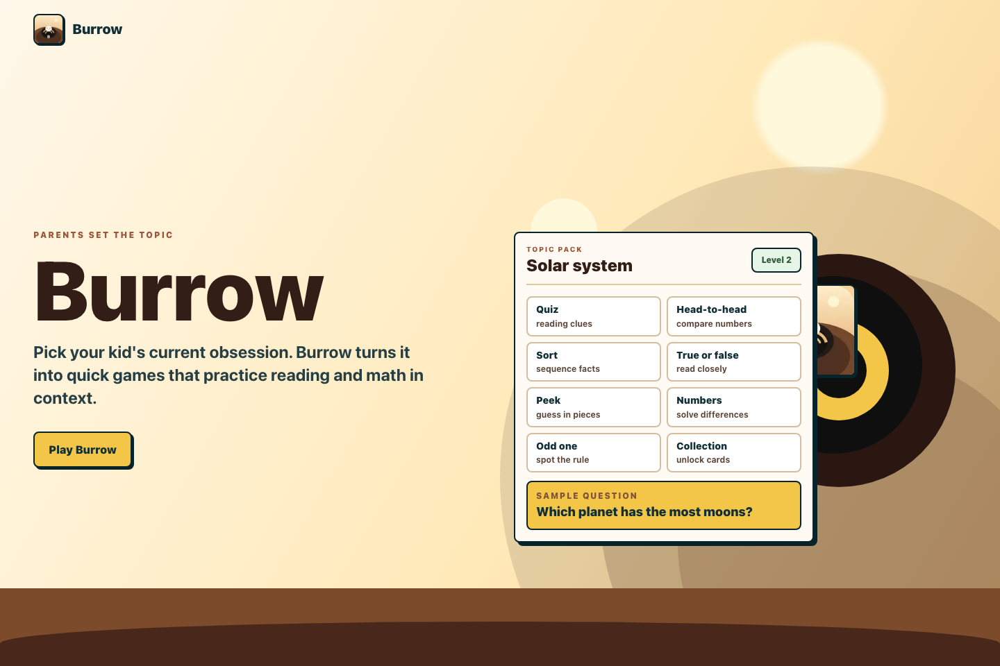
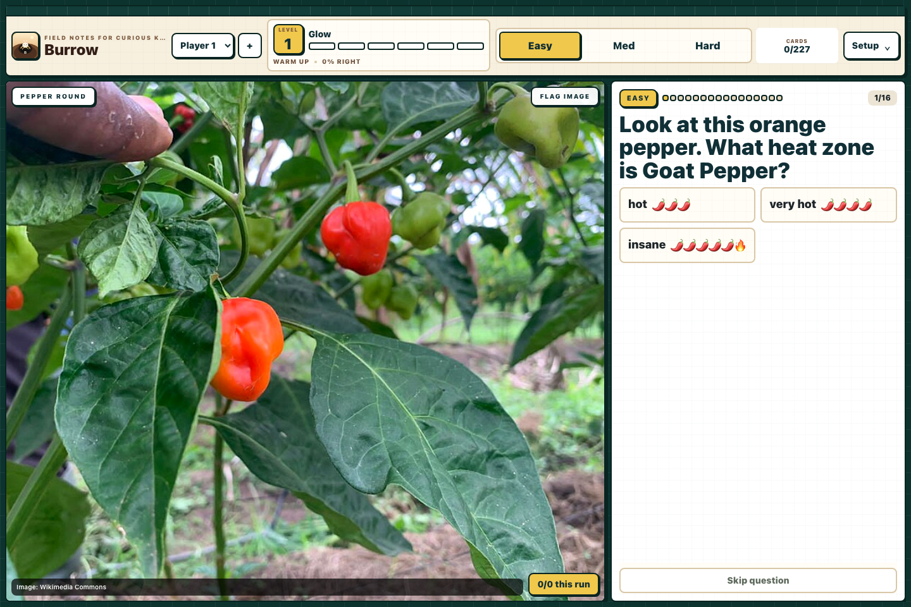

# Burrow

Burrow is a local-first learning game for short, visual quiz sessions. Pick a kid's current obsession, then Burrow turns it into fast reading and math rounds with real images, structured facts, and lightweight progress tracking.

[](https://github.com/amamujee/rabbit-hole-app/actions/workflows/ci.yml)



## What It Does

- Runs quick rounds across quiz, head-to-head, Top Trumps, sorting, true/false, peek, number, and odd-one-out modes.
- Ships with curated topic packs for peppers, skyscrapers, sharks, space, and jets.
- Keeps gameplay local: topic images are cached in `public/burrow-assets`, and player progress lives in `localStorage`.
- Tracks image provenance on every card so visual content can be audited or refreshed.
- Includes content QA scripts, local image checks, and Playwright coverage for the main play flow.



## Links

- Repository: [github.com/amamujee/rabbit-hole-app](https://github.com/amamujee/rabbit-hole-app)
- Issues: [github.com/amamujee/rabbit-hole-app/issues](https://github.com/amamujee/rabbit-hole-app/issues)
- Next.js app docs: [nextjs.org/docs/app](https://nextjs.org/docs/app)
- Vercel deploy docs: [vercel.com/docs](https://vercel.com/docs)

## Tech Stack

- [Next.js](https://nextjs.org/) 16 App Router
- [React](https://react.dev/) 19
- [Tailwind CSS](https://tailwindcss.com/) 4
- [Playwright](https://playwright.dev/) for end-to-end tests
- [Vercel Analytics](https://vercel.com/analytics)

## Getting Started

Requirements:

- Node.js 20.9 or newer
- npm

Install dependencies and start the local app:

```bash
npm install
npm run dev
```

Open [http://localhost:3000](http://localhost:3000), or go straight to the game at [http://localhost:3000/play](http://localhost:3000/play).

## Useful Scripts

```bash
npm run dev          # Start the Next.js dev server
npm run build        # Create a production build
npm run start        # Run the production build
npm run lint         # Run ESLint
npm run check:images # Verify gameplay images are local and present
npm run qa:content   # Run content quality checks
npm run test:e2e     # Run Playwright tests
npm run verify       # Run the full pre-publish check
```

## Content Packs

Topic records live in `src/lib/game-data.ts`. Each card keeps structured stats plus image provenance:

- `contentImage(topic, id, sourceFile)` points gameplay at `/public/burrow-assets/...`.
- `imageCredit` credits the curated source.
- `imageSourceFile` and `imageSourceUrl` preserve where the local asset came from.

The app should not load topic images from the internet during play. To add a topic or card:

1. Add the structured record and `contentImage(...)` source metadata.
2. Run `npm run sync:assets` during development to cache images locally.
3. Run `npm run check:images`; it fails on missing local assets or remote runtime image URLs.

Use `npm run sync:assets -- --only=sharks/great-white --force` to refresh one asset.

## Content Issue Reports

The in-game "Flag image" control stores a local report in the browser and posts it to `POST /api/content-issues`. In local development, the API appends reports to `.burrow/content-issues.jsonl`, which is intentionally ignored by git.

## Publishing Notes

- Keep `public/burrow-assets` committed so the game works offline and does not hotlink topic images.
- Run `npm run verify` before opening a pull request or publishing a release.
- The package stays marked as private to prevent accidental npm publishing; this repo is intended to be public source, not a published package.
