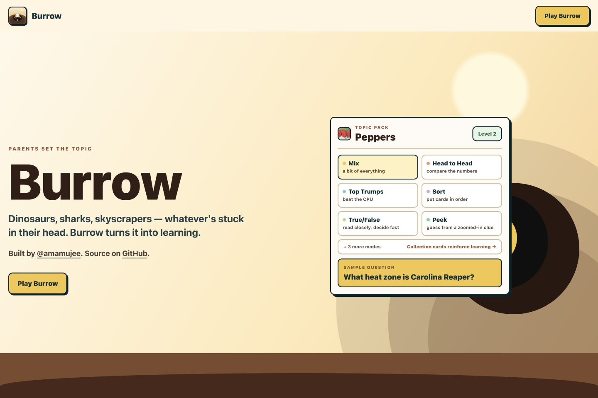
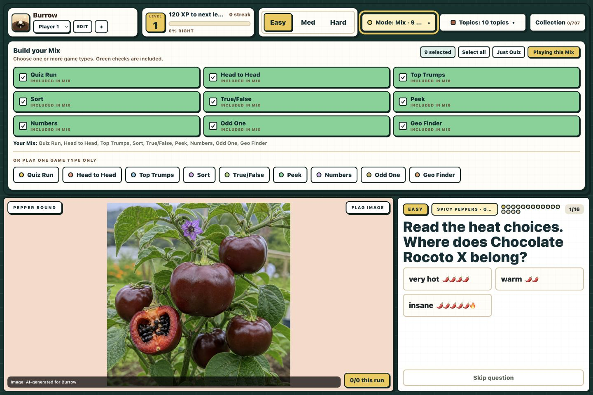

# Burrow

Burrow is a local-first learning game that turns a kid's current obsession into short, visual reading, math, science, and geography sessions. Choose the topics, combine the game types that fit, and let Burrow keep the practice varied while progress and collections grow.

[](https://github.com/amamujee/burrow/actions/workflows/ci.yml)



## What Burrow Does

- Makes game selection a first-class multi-select: include any combination of Quiz Run, Head to Head, Top Trumps, Sort, True/False, Peek, Numbers, Odd One, and Geo Finder.
- Keeps single-mode play available when a child wants to focus on one game type.
- Ships with ten topic packs: peppers, skyscrapers, sharks, space, jets, countries and flags, dinosaurs, tallest mountains, tall trees, and bridges and tunnels.
- Uses real facts, comparable stats, maps, and credited local images to teach in context.
- Adapts future questions using recent answers and revisits concepts that need more practice.
- Unlocks collection cards through correct answers while preserving separate progress for each player.
- Stores player progress locally and caches the app shell and learning assets for offline use.



## How the Content Is Organized

Five core catalogs—peppers, skyscrapers, sharks, space, and jets—live in `src/lib/game-data.ts`; the 200-country catalog lives in `src/lib/countries-data.ts`. Four contributor-friendly playable packs—dinosaurs, tallest mountains, tall trees, and bridges and tunnels—live under `content/packs/` and are loaded by the app when their `pack.json` has `"status": "playable"`.

Every card includes structured facts, comparable stats, local imagery, and image provenance. Gameplay never needs to hotlink topic images from the internet.

## Getting Started

Requirements:

- Node.js 20.9 or newer
- npm

Install dependencies and run the app:

```bash
npm install
npm run dev
```

Open [http://localhost:3000](http://localhost:3000), or go directly to [http://localhost:3000/play](http://localhost:3000/play).

## Useful Scripts

```bash
npm run dev            # Start the Next.js development server
npm run build          # Create a production build
npm run start          # Run the production build
npm run lint           # Run ESLint
npm run validate:packs # Validate repo-authored pack JSON files
npm run check:images   # Verify local image files and report duplicates
npm run qa:content     # Run content-quality checks
npm run test:logic     # Run logic and content coverage
npm run test:e2e       # Build and run browser coverage
npm run verify         # Run the complete pre-publish check
```

## Make Your Own Pack

Copy the template to start a new topic:

```bash
cp -R content/packs/_template content/packs/construction-trucks
```

Then:

1. Edit `content/packs/construction-trucks/pack.json` and keep the folder and pack IDs aligned.
2. Add at least 16 cards, reusable numeric stats, useful categories, and short child-friendly facts.
3. Put each credited image under `public/burrow-assets/construction-trucks/`.
4. Set the pack status to `playable` when it is ready to appear in Burrow.
5. Validate it:

```bash
npm run validate:packs -- --pack construction-trucks
```

See [Making a Burrow Pack](docs/pack-authoring.md) for the schema, image rules, examples, and contributor checklist.

## Content Quality and Privacy

- `npm run check:images` rejects missing files and remote runtime image URLs.
- `npm run qa:content` checks content completeness, quality signals, and playable pack data.
- The in-game **Flag image** action stores a report locally and sends it to `POST /api/content-issues`; local development writes `.burrow/content-issues.jsonl`.
- Anonymous play-quality events can be summarized with `npm run analyze:play-events`. Player names are not sent, and local identifiers are hashed before server logging.
- `.burrow/`, environment files, Vercel project metadata, test output, and local QA screenshots are ignored by git.

## Tech Stack

- [Next.js](https://nextjs.org/) 16 App Router
- [React](https://react.dev/) 19
- [Tailwind CSS](https://tailwindcss.com/) 4
- [Playwright](https://playwright.dev/) for logic and browser coverage
- [Vercel Analytics](https://vercel.com/analytics)

## Contributing

- Run `npm run verify` before opening a pull request.
- Keep `public/burrow-assets` committed so the game remains local-first and offline-friendly.
- Preserve image credits and source URLs whenever content or imagery changes.
- Use [GitHub Issues](https://github.com/amamujee/burrow/issues) for bugs and content problems.

The package is intentionally marked private to prevent accidental npm publication; the repository itself is public source.
